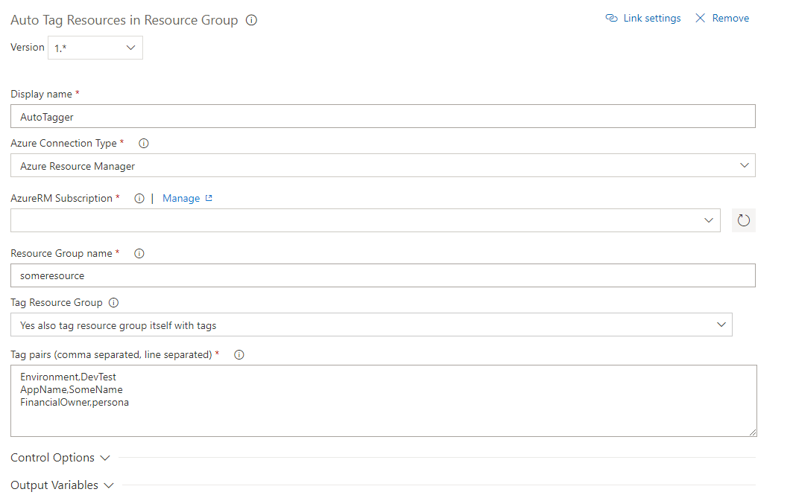

# AutoTagging

This extension adds tags to all resources in any given resourcegroup.

Usually this task is ran at the end of the deployment of all your resources.

## Help & Contact

See my blog for more info: https://www.peterrombouts.nl/index.php/2018/07/17/vsts-extension-tagging-all-resources-within-a-resource-group